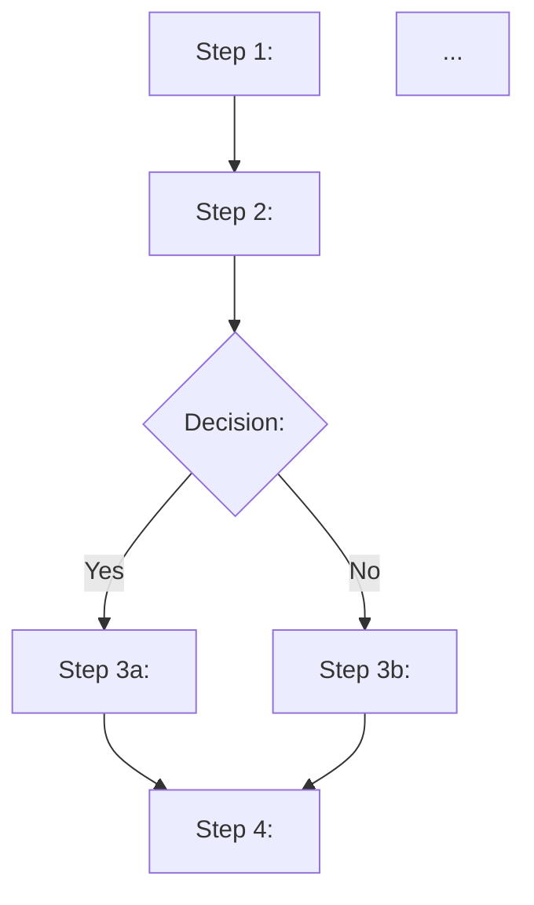

> **Workspace root.** Every relative path in this SKILL.md (`vto.md`, `accountability-chart.md`, `issues-list.md`, `BOOTSTRAP.md`, `BOOTSTRAP-COMPLETE.md`, `meeting-notes/`, `rocks/`, `scorecards/`, `people-analyzer/`, `processes/`, `quarterly-conversations/`, `snapshots/`, `.agents/skills/`, `scripts/`) is resolved against the EOS workspace root — the directory that contains `BOOTSTRAP.md`, `AGENTS.md`, and `.agents/skills/`. Before doing anything else, find that directory and `cd` into it. Do not write artifacts to the operator's current working directory if it isn't the workspace root.
>
> Discovery, in order:
>
> 1. **cwd test.** If `./BOOTSTRAP.md` and `./.agents/skills/` both exist, cwd IS the workspace root. Done.
> 2. **Global-install lookup.** Otherwise the skill was invoked globally via a `~/.claude/skills/<prefix>eos-document-core-process` symlink. Resolve the workspace root with:
>    ```bash
>    LINK=$(find -L ~/.claude/skills -maxdepth 1 -type l -lname "*/.agents/skills/eos-document-core-process" 2>/dev/null | head -1)
>    [ -n "$LINK" ] && WORKSPACE_ROOT=$(cd "$(readlink -f "$LINK")/../../.." && pwd)
>    ```
> 3. **Multi-workspace tiebreak.** If step 2 finds multiple symlinks (operator runs more than one EOS workspace), match the slash-command prefix the operator just used. Example: `/acme-eos-document-core-process` → pick the symlink named `acme-eos-document-core-process`. If you can't tell, ask the operator which workspace to run against.
> 4. **No workspace found.** Halt and tell the operator to `cd` into their EOS workspace, or to run `bash scripts/install-global-skills.sh [prefix]` from inside that workspace to register it for global invocation.
>
> Then `cd "$WORKSPACE_ROOT"` and proceed with the rest of this skill.

# Document Core Process

Every company has 6-10 Core Processes: sales, marketing, operations, customer service, HR, finance, plus 1-3 industry-specific ones. Most companies have none of them documented. The people closest to the work hold the steps in their heads, hand-offs leak, new hires guess, and the company runs on tribal knowledge.

This skill turns the agent into the workshop facilitator and scribe for documenting one Core Process. The agent walks the subject-matter expert (SME) through writing the steps, brings in an outsider to test the draft, then compresses everything to one page. The output is a one-page visual document that codifies The Proven Way and replaces tribal knowledge.

One process per workshop. Documenting multiple processes in one session produces shallow documentation of each.

## Inputs

Before starting, locate or ask for:

- The name and scope of the Core Process being documented (e.g., "Sales process from first contact through closed deal", "Customer onboarding from contract signed through first value delivered").
- The SME: the person who actually does the work most often. Usually the function head or their senior practitioner.
- The function head (if not the SME).
- The outsider: a person not involved in this process who will follow the draft. Often a leader from another function or a new hire.
- Any prior version of the process documentation, even if informal (Notion page, Word doc, slack message).
- The [Accountability Chart](https://traction.wiki/tools/accountability-chart) to confirm which function head owns the document going forward.

In the business-instance repo:

- `accountability-chart.md`
- `processes/<process-name>.md` (prior version, if any)
- `processes/index.md` (the master "The Way" index)

If no prior version exists, this is a first-time documentation. If a prior version exists, the workshop is a refresh and the agent diffs old to new.

## The Session

The agent runs the three steps in order. 3-4 hours per process.

### Step 0: Frame and Scope (15 min)

The agent confirms the scope out loud:

- **What is this Core Process?** Prompt: "Name it. Use the Core Process framing, not a project framing. Sales is a Core Process. The Q3 product launch is a project. If the work happens once a year or once ever, it does not belong in the Core Process binder."
- **Where does it start, where does it end?** Prompt: "What is the trigger that begins this process? What is the output that ends it?"
- **Who owns the document going forward?** Usually the function head. Confirm.

If the process feels like it should be split (e.g., "Sales" is actually "Lead generation" + "Closing"), the agent splits now and picks one to document in this workshop.

### Step 1: Write the Steps (75 min)

The SME walks the agent through the process. The agent (as scribe) captures each step.

Discipline the agent enforces:

- **7-15 steps total.** Fewer than 7 means the documentation is too high-level. More than 15 means the process needs splitting into sub-processes.
- **Each step starts with a verb.** "Send the discovery follow-up email." "Verify customer credit." "Schedule the kickoff call."
- **Decision points are explicit.** Diamonds with Yes/No branches.
- **Responsible party noted next to each step.** "Sales rep." "AE." "Operations coordinator." Hand-offs are visible where the responsible party changes.
- **Templates and tools referenced inline.** "Send the discovery follow-up email (template: `sales/discovery-followup.md`)."
- **Skip the minutiae.** The document captures the way, not every keystroke. The agent rejects entries like "Open the CRM, click on the contact, hover over the email field, click Compose..." and rewrites them to "Send the standard discovery follow-up email (template linked)."

The output of step 1 is a draft that is probably 2-3 pages, longer than it needs to be, and ready for step 2.

### Step 2: Test and Refine (75 min)

The agent brings in the outsider.

The outsider takes the draft and *follows it*. They are pretending to do the process. The SME and function head watch silently. The agent watches and captures every place the outsider:

- Gets stuck.
- Has to ask a question.
- Makes a wrong assumption.
- Needs information not in the document.
- Goes off the documented path.

Every one of those is a defect. The agent captures each as a row in a defect log:

| Step | What went wrong | Fix |
|---|---|---|

After the run-through, the agent walks the team through fixing each defect in the document. The fix is usually adding clarity, removing ambiguity, or making a hand-off explicit.

If the outsider gets through the document smoothly with no defects, the document is too high-level. The agent pushes for harder edge cases: "What happens when the customer has special pricing? What happens when the discovery call no-shows? What happens when the deal exceeds the standard contract size?"

### Step 3: Simplify (45 min)

The draft is now accurate but probably too long. Step 3 is compression.

The agent runs through these tactics with the team:

- **Use a flowchart layout.** Top to bottom, decision diamonds for branches, arrows for flow.
- **Combine steps where possible.** Two adjacent steps the same person does can often merge.
- **Use icons or visual cues.** A hand-off marker, a template icon, a decision diamond communicates faster than prose.
- **Cut prose that is not load-bearing.** The document captures the way, not the rationale. Rationale lives in the Core Process overview, not the one-pager.
- **Force the document onto one page.** This is the discipline. A four-page document does not get used. A one-page diagram gets pinned to the wall.

The output of step 3 is the one-page visual.

### Close (15 min)

The agent confirms:

- The document owner (typically the function head).
- The version-control location (`processes/<process-name>.md` in the business-instance repo).
- The rollout: when does the team that runs this process start using the document?
- Any Issues that surfaced (steps the process is missing entirely, tools the process needs, hand-offs that need redesign). These go to the L10 Issues List.

## Outputs

The agent produces a one-page Core Process document at `processes/<process-name>.md`:

```markdown
# <Process Name>

*<One-sentence purpose. E.g., "How a first-contact lead converts to a closed deal.">*

**Owner**: <function head name>
**Version**: YYYY-MM-DD
**Triggered by**: <trigger event>
**Ends at**: <output event>

---

## The Flow



*(Or hand-drawn / Lucidchart / Whimsical export pasted as `.png` alongside this file.)*

## Steps

1. **<Step name>** — <responsible party>. <One-line description, with template link if applicable>.
2. **<Step name>** — <responsible party>. ...
3. **<Decision>** — <responsible party>. Yes → step 3a. No → step 3b.
4. ...

## Hand-offs

- After step <N>: <person> hands off to <person>. <What gets handed off>.
- After step <N>: ...

## Templates and Tools Referenced

- <template name> at <path>
- <tool> for <step>

## Defect Log (from this workshop)

| Step | What went wrong (outsider test) | Fix |
|---|---|---|
| ... | ... | ... |
```

Additionally:

- Update `processes/index.md` to link the new document. If this is the first documented process, create the index.
- Any structural Issues surfaced (a step the process is missing, a tool that needs to be built, a hand-off that needs redesign) go on `issues-list.md`.
- If a visual was rendered (mermaid, Lucidchart export, hand-drawn photo), save it next to the `.md` file as `processes/<process-name>.png`.

## Failure Modes the Agent Should Catch

- **Stopping at step 1.** A draft document that has not been tested is a wish. Step 2 is where the document becomes real. The agent does not let the team skip the outsider test.
- **Skipping step 3.** A 4-page document is not a Three-Step output. It is a Word doc that nobody will use. The agent forces the one-page constraint.
- **Documenting from memory in isolation.** The SME alone, writing the steps without testing, leaves out everything they do unconsciously. The agent requires an outsider for step 2.
- **Over-detailing.** "Open the CRM, click on the contact..." is not a process step. The agent rewrites these inline to action-level language.
- **Documenting a project as a Core Process.** Core Processes are repeatable workflows, not one-time projects. If the work happens once a year or once ever, the agent flags it and the workshop stops.
- **Trying to document multiple processes in one workshop.** One process per workshop. If the team tries to expand scope, the agent splits and picks one.
- **Documenting the process the team wishes they had instead of the one they have.** The agent forces the SME to document the actual current way. If it is broken, the documentation surfaces that and the team can fix it via IDS. Document reality first.
- **No outsider for step 2.** Without an outsider, the SME and function head cannot see the gaps. They fill them from memory. If no outsider is available, the agent stops the workshop and reschedules with one.

## When To Stop

The skill is done when:

- The process scope is named (start, end, owner).
- 7-15 steps are captured with verbs, responsible parties, decision points, and hand-offs.
- The outsider test ran and every defect was fixed.
- The document fits on one page (visual + supporting bullets).
- The document is saved at `processes/<process-name>.md` and linked from the index.
- The rollout date is set.

The agent reports back: "Process documented. N steps. M defects fixed in step 2. Document is at <path>. Rolls out to the team on <date>. <N> structural Issues flagged."

## References

- [Three-Step Process Documenter](https://traction.wiki/tools/three-step-process-documenter) — the canonical tool page.
- [Document a Core Process](https://traction.wiki/playbooks/document-a-core-process) — the full workshop.
- [Core Process](https://traction.wiki/concepts/core-process) — the unit.
- [The Proven Way](https://traction.wiki/concepts/proven-way) — what the document codifies.
- [Process Component](https://traction.wiki/components/process) — the component this strengthens.
- [Simplify](https://traction.wiki/concepts/simplify) — the underlying principle.
- [Systemize](https://traction.wiki/concepts/systemize) — what this work enables across the company.
